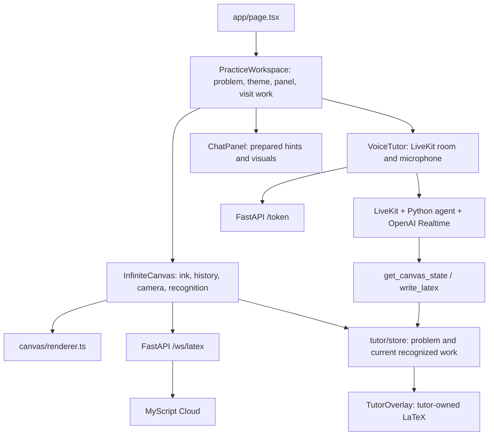

# Mimir project context

Updated **2026-09-19** after the frontend revamp and integration of the `latex` branch. This supersedes the original `568b8fd` inspection. Read [PRODUCT.md](../PRODUCT.md) for requirements and [DESIGN.md](../DESIGN.md) for the current visual system.

## Current experience

Mimir is a browser math practice workspace for iPad and Apple Pencil. The frontend now has a problem header, open dot-grid canvas, bottom drawing toolbar, and a responsive tutor sidebar. Light is the initial theme; the header offers dark mode. Three prepared algebra problems include hints, illustrative diagrams, and worked steps. The prepared guides are labeled and do not pretend to inspect student work.

Remote changes pulled during the revamp added MyScript conversion, LiveKit/OpenAI voice tutoring, and tutor-owned LaTeX annotations. These were preserved and integrated into the new layout. Actual provider credentials and a running Python agent are still required for the external services.

Repository: `Ishfaq-code/Mimir`. Local path: `/Users/stevin/Documents/Projects/Mimir`. The `stevin-port` portfolio and older Margin prototype are separate projects. Use Mimir's working directory explicitly.

## Capability inventory

| Feature | Current behavior |
| --- | --- |
| Writing | Custom Canvas 2D with Pointer Events and quadratic smoothing. Pen remains active and strokes stay unselected. |
| Drawing tools | Pen/Eraser, eight colors including white, widths 1/2/4, visible undo/redo. |
| Navigation | Wheel pan, modifier-wheel zoom, Space/middle-button drag, finger pan, zoom buttons. Active pointer guard ignores competing pointers during a gesture. |
| Practice | Three selectable algebra problems; each retains ink in memory while switching. History/tool/camera reset on remount. |
| Prepared guides | Per-problem hints, SVG visualizations, and incremental worked examples in the sidebar. |
| MyScript | Optional Typeset math switch groups completed strokes after a configurable pause (2 seconds by default) and calls `/ws/latex`. Successful results render at the original size, position, and ink color and are exposed to the voice tutor's canvas context. |
| Live voice | `VoiceTutor` obtains a token, joins LiveKit, publishes microphone audio, plays remote audio, and registers canvas RPCs. |
| Tutor annotations | Agent can inspect current problem/recognized work and call `write_latex`; annotations use world coordinates above the ink. |
| Error states | Recognition failures preserve ink and offer retry. Voice failures display a retryable error. |
| Persistence | Visit memory only. Closing the sidebar retains guides and any voice session; reload loses the visit. |
| Still absent | Teacher reports, accounts, database storage, imported questions, general visualization generation, glow/circle tools, stroke-animated demonstrations, reliable proactive error detection. |

## Stack and dependencies

- Next.js 16.3.5, React 19.2.8, TypeScript strict mode, Tailwind CSS 4, Geist UI font, KaTeX, `livekit-client`.
- FastAPI 0.115.12, Uvicorn 0.34.2, httpx, python-dotenv, LiveKit API.
- Separate Python worker in `agent/`, using LiveKit Agents and OpenAI Realtime. The worker is not a Docker Compose service.
- Docker uses Node 22 and Python 3.12. No Excalidraw SDK is installed.
- One application route, `/`; no Next API routes.



## Where changes belong

| File | Responsibility |
| --- | --- |
| `frontend/components/PracticeWorkspace.tsx` | App shell, selected problem, retained per-problem ink, theme, sidebar state and responsive accessibility. |
| `frontend/lib/problems.ts` | Three prepared problems, hints, worked steps, and visual captions. |
| `frontend/components/InfiniteCanvas.tsx` | Existing drawing engine, history, camera, Pointer Events, recognition WebSocket, rendering overlays. |
| `frontend/components/IslandToolbar.tsx` | Pen/Eraser, ink options popover, width, undo/redo. |
| `frontend/components/ChatPanel.tsx` | Prepared problem guide and SVG illustrations. It is not the live model's transcript. |
| `frontend/components/VoiceTutor.tsx` | LiveKit lifecycle, microphone/audio, connection state, errors. Kept mounted when sidebar closes; replaced/disconnected on problem changes. |
| `frontend/components/TutorOverlay.tsx` | World-positioned KaTeX annotations. Does not duplicate recognized student work already rendered by the canvas. |
| `frontend/components/Icon.tsx` | Shared inline SVG icons and Mimir mark. |
| `frontend/app/globals.css` | Semantic OKLCH tokens, light/dark themes, layout, components, responsive and reduced-motion rules. |
| `frontend/lib/canvas/types.ts`, `renderer.ts` | Geometry/camera types, point normalization, painting and smoothing. |
| `frontend/lib/tutor/store.ts` | Current problem, current recognition, tutor annotations, revision and subscriptions. |
| `frontend/lib/tutor/tutorCanvas.ts`, `livekit/rpc.ts` | Browser-side tutor abstraction and RPC methods. |
| `backend/main.py` | `/`, `/health`, `/token`, `/ws/latex`, MyScript signing and requests, CORS. |
| `agent/main.py`, `tutor.py`, `tools/canvas.py`, `prompts.py` | Live voice agent, tool dispatch, tutoring instructions. |
| `spec.md` | Collaborator's broader voice-tutor specification, including future milestones. Code determines which parts are implemented. |

`components/Canvas.tsx`, `components/LatexPreview.tsx`, and `lib/recognizer.ts` remain older unused scaffolding. The active MyScript pipeline is inside `InfiniteCanvas.tsx`, not that legacy recognizer.

## Ink and coordinate contracts

The source of truth is `CanvasElement[]`, not pixels. A freehand element has a stable ID, origin, dimensions, style, deletion flag, and relative `{x,y,t}` points. The active recognition buffer additionally retains world x/y, wall-clock timestamps, pressure, and pointer type. Line/arrow elements still use tuples; use `pointXY` when traversing mixed element types.

```text
world point  = element origin + relative point
screen point = (world point - camera position) * camera.zoom
world point  = screen point / camera.zoom + camera position
```

Screen coordinates are CSS pixels relative to the canvas. DPR scales only the backing bitmap. Freehand origins are the first pen position, not necessarily the upper-left bound; derive bounds from all points. The renderer uses the existing quadratic smoothing and round caps/joins. The eraser removes entire elements through padded bounding-box hit testing, not pixel erasure.

`ResizeObserver` resizes the backing store when the sidebar changes canvas width. On completed edits, a cloned scene is retained by `PracticeWorkspace` for the active problem. Undo/redo is local to the mounted canvas. Stored ink keeps literal colors across themes; white ink can be hard to see on the light canvas and black ink on the dark canvas. Theme changes adapt the next default pen color only.

## Recognition and voice boundaries

- Recognition is opt-in. `/ws/latex` round-trips request and stroke IDs with structured strokes so each response maps back to its source ink.
- The current pipeline groups unrecognized strokes completed within the configured pause into one expression. It can retain multiple recognized overlays, but does not semantically segment lines, regions, or individual symbols.
- Successful recognition hides only its source ink and overlays normalized KaTeX without deleting geometry. Disabling conversion restores all original ink.
- The tutor store includes the selected problem as known context (`practice-problem`) and, when available, the current recognized expression (`student-work`). It starts without fabricated student ink.
- Prepared hints are local content. Live voice and annotations come from the separately configured agent. Do not present prepared hints as evidence of AI understanding.
- Changing problems clears stale recognized context and tutor annotations and disconnects the old voice component. Closing the sidebar preserves the voice session; reopen Tutor to end it.
- The agent currently has `get_canvas_state` and `write_latex`; other tools mentioned in its broader prompt/spec are not implemented yet.

## Runtime and setup

See [README.md](../README.md) for exact commands. Frontend is on `3000`, backend on `8000`. Docker frontend is a production build with no source mount. Backend uses a source mount and Uvicorn reload; dependency changes still require rebuilding.

`backend/.env` is ignored and must exist for Compose. No provider credentials were supplied during the revamp; a comment-only local file was created to allow the core app to run. Configure MyScript/LiveKit from `backend/.env.example`, and OpenAI/LiveKit worker settings from `agent/.env.example`. Never place provider secrets in a `NEXT_PUBLIC_*` variable.

Frontend overrides: `NEXT_PUBLIC_TOKEN_URL`, `NEXT_PUBLIC_RECOGNIZER_WS_URL`, and `NEXT_PUBLIC_RECOGNITION_PAUSE_MS`. Network defaults use the browser hostname and backend port 8000; the recognition pause defaults to 2000 ms. Production/tunnel URLs and CORS need deliberate configuration. The current backend CORS list is only `http://localhost:3000`. iPad microphone access requires an appropriate secure browser origin; desktop localhost does not establish iPad HTTPS readiness.

## Verification record

The frontend revamp was checked with ESLint, TypeScript, and Docker production builds. Browser checks covered pen drawing, erasing, undo/redo, per-problem ink retention, color options/white ink, theme changes, panel resizing, hints, SVG visuals, worked steps, and layouts at desktop, 1024 × 768, and 390 × 844. A focused store check verified that clearing recognition preserves the known problem and that changing problems clears stale context.

The production containers were restarted successfully; `/health` returned OK. Without credentials, `/token` returned the expected configuration failure, and the browser showed a recoverable voice error. Recognition failure/retry UI was also checked and preserved the ink.

No real provider session or physical Apple Pencil test was completed. A visual viewport check is not a hardware test. No permanent automated test suite is configured. Keep actual external-service verification separate from frontend checks.

## Remaining technical work

- Configure and validate the full voice/recognition path on the actual iPad.
- Improve region recognition and confidence handling before proactive tutoring.
- Add precise highlighting, animated demonstrations, and durable visit storage.
- Verify palm rejection and multi-touch navigation. Current finger gestures pan; pressure is captured for recognition but does not affect stroke width.
- Decide how to persist history/camera per problem. Current problem switching preserves ink only.
- Consider single-point ink dots, precise erasing, history memory, and full-scene redraw cost for long sessions.
- Revisit accessibility beyond the current labels, focus treatment, responsive inert workspace, and reduced-motion rules. No formal conformance level has been established.

The user's workflow is direct work on `main`, with a fresh pull before new changes and preservation of collaborators' work. Keep this context current when integrations or product decisions change.
