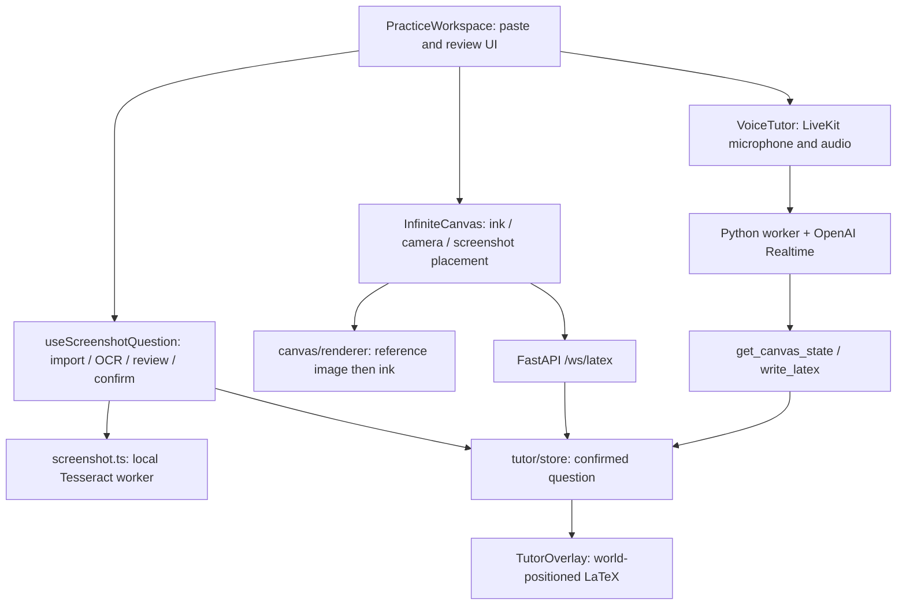

# Mimir project context

Updated **2026-09-19** after screenshot import/OCR review, text-tool work, and integration of the `latex` branch. Read [PRODUCT.md](../PRODUCT.md) for intent and [DESIGN.md](../DESIGN.md) for current UI conventions.

## Current experience

Mimir is an iPad-oriented math workspace. The student pastes a screenshot directly into the whiteboard using the native paste command or Paste screenshot button. The image is placed in world coordinates behind the ink. Browser-based OCR reads the question; a side panel asks “Is this right?” and provides editable text. The floating Tutor island opens live voice with or without a pasted question; confirming publishes reviewed text to the tutor when available. Preset questions, prepared guides, and decorative copy have been removed.

Repository: `Ishfaq-code/Mimir`. Local root: `/Users/stevin/Documents/Projects/Mimir`. The thread's default `stevin-port` directory is a separate project. Work on `main`, pull before implementation, preserve collaborators, and never force-push.

## Capability inventory

| Feature | Current behavior |
| --- | --- |
| Screenshot input | Native image paste or Clipboard API button. PNG, JPEG, WebP, GIF; 12 MB / 32 million pixel limits. Input errors preserve the existing question. |
| Screenshot on board | One current reference image behind student ink. Moves with pan/zoom; Show question returns the camera to it. New screenshots replace the reference and preserve ink/history. The reference is not an erasable stroke. |
| Screenshot OCR | Tesseract.js 7, English LSTM data, browser worker, same-origin assets. No credentials, upload, or provider charge for OCR. Maximum OCR dimension 2400 px; 90 second timeout. |
| Review | Editable plain text, empty confirmation disabled, retry/manual fallback, cancellation and stale-result guards. Normal text paste remains available inside the correction field. |
| Voice context | `CanvasState.question` holds only confirmed text, separate from recognized student equations. Editing/replacing clears it and unmounts/disconnects voice. Closing the sidebar preserves voice. |
| Canvas selection | Select (V/1) supports click/Shift-click, marquee selection, multi-element movement, and corner resizing. Pasted screenshots can also be selected, moved, and resized. |
| Textboxes | Select Text (T), tap to place or edit. Done/Enter saves, Shift+Enter adds a line, Escape/Cancel discards. Uses ink color; undo/redo and eraser apply. Text remains visual canvas content, separate from question confirmation and stroke recognition. Selecting a textbox and choosing Visualize immediately requests a Physics word-problem visualization. |
| Handwriting | Existing custom Canvas 2D engine. Pen stays selected; no stroke selection handles. Eight colors including white, widths 1/2/4, undo/redo. |
| Navigation | Wheel pan, modifier-wheel zoom, Space/middle-button drag, finger pan, zoom controls. |
| MyScript | Optional Typeset math switch recognizes freehand strokes via backend `/ws/latex`. Separate from screenshot OCR. |
| Typeset math | Completed strokes are grouped after a configurable pause (2 seconds by default); normalized KaTeX overlays preserve source bounds/color and are exposed to the tutor context. |
| Live voice | `VoiceTutor` obtains a token, joins LiveKit, publishes microphone audio, plays remote audio, and registers canvas RPCs. |
| Tutor annotations | Configured LiveKit/OpenAI agent can read canvas context and write LaTeX through RPC. |
| Error states | Recognition failures preserve ink and expose retry. Voice failures show a recoverable error. |
| Persistence | In-memory visit only. Reload clears image, reviewed question, and ink. |
| Visualization | Selected textbox or confirmed question text is sent with `kinematics` topic to `POST /visualize` (legacy `physics` still accepted). OpenRouter extracts inputs for a single object moving in one direction with constant acceleration. Visualize requires a selected textbox or selected confirmed screenshot; no selection shows paste/select guidance. Plain-text native paste creates a wrapped, undoable textbox. Fixed demo paragraphs in `docs/DEMO_PROBLEMS.md` match deterministic backend templates without provider calls. `GET /visualize/question?kind=speed_up\|braking\|constant_speed\|free_fall` returns question text and nine matching frames without a provider call. Timeline and variable controls render the result. |
| Absent | Accounts, teacher reports, durable storage, other import methods, generated visualizations beyond the Physics keyframe flow, precise highlighting, animated demonstrations, reliable proactive error detection. |

## Ownership and data flow

| File | Responsibility |
| --- | --- |
| `frontend/components/PracticeWorkspace.tsx` | Floating Tutor island, native paste listener, Clipboard API button, question review, theme, responsive panel, and voice lifecycle. |
| `frontend/lib/useScreenshotQuestion.ts` | Screenshot lifecycle, asynchronous import versions, abortable OCR, editable text, confirmation and tutor context. |
| `frontend/lib/screenshot.ts` | File validation/decode, Tesseract lazy import, OCR progress/timeout/cancellation, worker cleanup. |
| `frontend/scripts/prepare-ocr.mjs` | Copies installed worker, core variants, language data, and licenses to ignored `public/ocr/` before dev/build. |
| `frontend/components/InfiniteCanvas.tsx` | Existing stroke capture/history/recognition, camera, reference image placement, canvas tools, and selected-text visualization requests. |
| `frontend/components/VisualizationResult.tsx` | Safe SVG renderer for validated visualization keyframes, timeline slider, and Previous/Next controls. |
| `frontend/lib/canvas/renderer.ts` | World-space image followed by ink painting. Existing smoothing is unchanged. |
| `frontend/components/IslandToolbar.tsx` | Pen/Eraser/Text, colors/width, undo/redo. |
| `frontend/components/CanvasTextEditor.tsx` | Positioned textbox editor, multiline input, outside-click save, cancellation and focus handling. |
| `frontend/components/VoiceTutor.tsx` | Existing LiveKit token, room, microphone/audio and RPC lifecycle. |
| `frontend/lib/tutor/store.ts`, `types.ts` | Separate confirmed question, recognized equations, tutor annotations, revisions/subscriptions. |
| `frontend/components/TutorOverlay.tsx` | KaTeX annotations aligned with camera. |
| `frontend/app/globals.css` | Warm neutral / green tokens, dark theme, controls, review panel, responsive and reduced-motion rules. |
| `backend/main.py` | Health, token minting, MyScript WebSocket recognition, OpenRouter visualization generation, and CORS. |
| `agent/prompts.py` | Tutor reads confirmed question as problem data, distinct from student work and role instructions. |

`components/Canvas.tsx`, `LatexPreview.tsx`, and `lib/recognizer.ts` are disconnected scaffolding. There is no Excalidraw SDK. `ChatPanel.tsx` and `lib/problems.ts` were removed with the preset flow. `spec.md` includes planned agent tools that do not all exist yet.

## Contracts and limitations

Student work remains `CanvasElement[]`, with relative freehand points and timestamps. World-to-screen coordinates are `(point - camera position) * zoom`; DPR affects backing bitmap only. The reference image is a separate read-only layer, so erasing/undo touches ink rather than accidentally deleting the question. A new paste anchors the reference in the current viewport. A screenshot is never sent to MyScript, which requires stroke geometry.

OCR targets clear printed English and basic algebra. It produces text, not structural math or diagram understanding. Fractions, powers, handwriting, and diagrams can need corrections. Every OCR result requires review, regardless of confidence. Only the confirmed text reaches the voice RPC context; OCR itself sends no image off-device. Voice and MyScript remain external services when explicitly activated.

`setConfirmedQuestion(null)` clears previous question, recognized work, and annotations. New handwriting recognition remains independent and can later repopulate student equations. The image/text/ink have no durable storage. Opening a fresh question keeps existing ink intentionally; it does not silently erase the student's page.

The handwritten expression recognizer still treats the entire freehand scene as one expression. Success temporarily replaces visible ink with KaTeX; new strokes or disabling conversion restore ink. Exact region matching and proactive tutoring remain future work.

## Runtime

See [README.md](../README.md). Next.js 16.3.5 / React 19 / TypeScript, Tesseract.js 7, KaTeX, LiveKit client. FastAPI backend and separate Python LiveKit agent. Docker uses Node 22 / Python 3.12. Frontend dev is on port 3000, backend on 8000. Both Compose services hot-reload from source mounts: the backend with Uvicorn `--reload`, the frontend with `next dev` (Turbopack) plus a named `node_modules` volume. After dependency changes, run `docker compose exec frontend npm install` or `docker compose down -v && docker compose up --build`; the production image remains the Dockerfile's default target.

- Recognition is opt-in. `/ws/latex` round-trips request and stroke IDs with structured strokes so each response maps back to its source ink.
- The current pipeline groups unrecognized strokes completed within the configured pause into one expression. It can retain multiple recognized overlays, but does not semantically segment lines, regions, or individual symbols.
- Successful recognition hides only its source ink and overlays normalized KaTeX without deleting geometry. Disabling conversion restores all original ink.
- Only confirmed screenshot text enters `CanvasState.question`; recognized student equations remain separate context. The store starts without fabricated student ink.
- Changing or replacing a question clears stale recognized context and tutor annotations and disconnects the old voice component. Closing the sidebar preserves the voice session.
- The agent currently has `get_canvas_state` and `write_latex`; other tools mentioned in its broader prompt/spec are not implemented yet.

Screenshot OCR works without provider keys. Its lazy-loaded assets come from `/ocr/` on this app, generated before build/dev and excluded from Git, lint, and Docker input context. Docker's builder regenerates them and its runner serves them from public.

`backend/.env` is ignored. Configure MyScript, LiveKit, and the OpenRouter visualization key there; configure OpenAI/LiveKit separately in `agent/.env` for voice. The agent runs separately. Defaults use the browser hostname on backend port 8000. Backend CORS currently allows only `http://localhost:3000`; configure origins deliberately for a tunnel/deployment. iPad Clipboard API and microphone access need a secure supported origin; localhost on desktop does not verify iPad HTTPS readiness.

## Verification

Frontend overrides: `NEXT_PUBLIC_TOKEN_URL`, `NEXT_PUBLIC_RECOGNIZER_WS_URL`, and `NEXT_PUBLIC_RECOGNITION_PAUSE_MS`. Network defaults use the browser hostname and backend port 8000; the recognition pause defaults to 2000 ms. Production/tunnel URLs and CORS need deliberate configuration. The current backend CORS list is only `http://localhost:3000`. iPad microphone access requires an appropriate secure browser origin; desktop localhost does not establish iPad HTTPS readiness.

The frontend revamp covered pen/eraser, history, colors, themes, recognition/voice failure states, responsive layouts, screenshot OCR review, and the Text tool. Browser checks exercised a clipboard PNG (`Solve for x. 2(x + 3) = 14`), correction/confirmation, empty submission blocking, cancellation, repeat paste, blank-image fallback, ink preservation, and multiline text editing. A store contract check verified only confirmed text becomes question context and clearing it removes stale work/annotations.

ESLint, TypeScript, and the Docker production build passed. Production OCR was also verified through the Paste screenshot button against real PNG clipboard data, with no browser runtime errors. Screenshot import passed desktop browser checks. The browser viewport override did not change the measured viewport during this run, so mobile layout and physical iPad clipboard/Pencil behavior still need a device check. Do not claim a hardware pass. No real LiveKit/OpenAI/MyScript/OpenRouter provider roundtrip was completed.

The Text tool was checked by creating multiline text, reopening it, saving corrections, canceling, undoing/redoing edits, clicking outside to create another box, switching to Pen, and erasing a textbox. Lint, TypeScript, and the production build passed. Physical iPad keyboard behavior remains unverified.

### Kinematics implementation, 2026-09-20

Generated practice uses randomized numeric templates and the same deterministic solver as custom problems. Questions cover speeding up, braking to rest, constant speed, and downward free fall with explicit gravity. Text and frames are returned together, so generation does not depend on extraction accuracy. The solver now handles initial/final speed plus duration and constant speed plus distance, rejects inconsistent or unreachable states, and rejects direction reversal. Horizontal motion has correctly directed velocity/acceleration arrows; downward free fall uses a ball. Multiple moving bodies, collision/optimization constraints, and unknown initial speed remain unsupported, with a scope-specific recovery message and generated questions available in the dialog. Generated practice stays separate from voice/screenshot context.

The existing `visualize-tool` checkout was merged with `origin/main` to retain the collaborator's graph tool. Merge verification passed TypeScript; full ESLint reports four pre-existing errors in the incoming `GraphOverlay.tsx` (state updates in effects and ref writes during render).

Verification: seven backend regression tests passed, including 200 seeded question/animation pairs, the initial/final-speed solver regression, invalid motion rejection, the original two-ball rejection, and all generated endpoints with provider configuration disabled. TypeScript, ESLint on changed frontend components, and an isolated Docker production build passed. Disposable Chromium exercised all four question types through their final frames, mobile width 390 px, light/dark themes, focus restoration, and request cancellation, with no page runtime errors. Physical iPad/Pencil behavior was not tested. Generated practice made no provider calls; the revised custom-extraction prompt was not revalidated with a live model during this implementation.

## Next work

Validate native screenshot paste and review on the actual iPad; configure and exercise live tutoring. Consider math-specialized OCR for notation beyond simple printed algebra. Later inputs should feed the existing import/review/confirm boundary. Preserve cancellation, confirmation gating, and normal text editing. Add region-based handwriting context, precise annotations, generated visualizations, and persistence after the core demo works.

### Paste-to-visualize update, 2026-09-20

The current UI supersedes the generated-question selector described above. Paste plain text, select its textbox, and click Visualize. The modal never silently substitutes generated practice. Four copyable demo questions use whitespace-normalized exact matching before provider extraction; edits to their content use normal extraction. Screenshot confirmation and voice context remain separate.

Verification for this update: TypeScript and targeted frontend ESLint passed; all eight backend regression tests passed. Disposable Chromium exercised all four pasted demo paragraphs through selection and modal rendering, empty-selection guidance, Escape, and a 390 px dark layout with no runtime errors. Physical iPad/Pencil and live custom-provider extraction were not tested. The existing graph lint failures remain outside this change.
