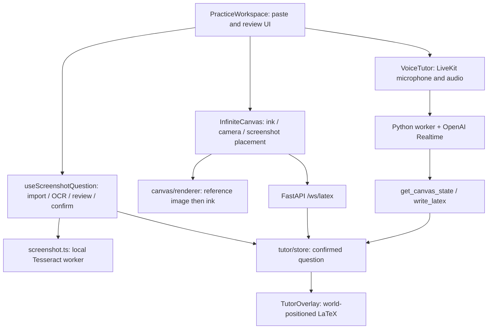

# Mimir project context

Updated 2026-09-19 for screenshot import and OCR review, after pulling `main` at `82ca415`. Read [PRODUCT.md](../PRODUCT.md) for intent and [DESIGN.md](../DESIGN.md) for UI conventions.

## Current experience

Mimir is an iPad-oriented math workspace. The student pastes a screenshot directly into the whiteboard using the native paste command or Paste screenshot button. The image is placed in world coordinates behind the ink. Browser-based OCR reads the question; a side panel asks “Is this right?” and provides editable text. Confirming enables live voice and publishes the reviewed text to the tutor. Preset questions, prepared guides, and decorative copy have been removed.

Repository: `Ishfaq-code/Mimir`. Local root: `/Users/stevin/Documents/Projects/Mimir`. The thread's default `stevin-port` directory is a separate project. Work on `main`, pull before implementation, preserve collaborators, and never force-push.

## Capability inventory

| Feature | Current behavior |
| --- | --- |
| Screenshot input | Native image paste or Clipboard API button. PNG, JPEG, WebP, GIF; 12 MB / 32 million pixel limits. Input errors preserve the existing question. |
| Screenshot on board | One current reference image behind student ink. Moves with pan/zoom; Show question returns the camera to it. New screenshots replace the reference and preserve ink/history. The reference is not an erasable stroke. |
| Screenshot OCR | Tesseract.js 7, English LSTM data, browser worker, same-origin assets. No credentials, upload, or provider charge for OCR. Maximum OCR dimension 2400 px; 90 second timeout. |
| Review | Editable plain text, empty confirmation disabled, retry/manual fallback, cancellation and stale-result guards. Normal text paste remains available inside the correction field. |
| Voice context | `CanvasState.question` holds only confirmed text, separate from recognized student equations. Editing/replacing clears it and unmounts/disconnects voice. Closing the sidebar preserves voice. |
| Textboxes | Select Text (T), tap to place or edit. Done/Enter saves, Shift+Enter adds a line, Escape/Cancel discards. Uses ink color; undo/redo and eraser apply. Text remains visual canvas content, separate from question confirmation and stroke recognition. |
| Handwriting | Existing custom Canvas 2D engine. Pen stays selected; no stroke selection handles. Eight colors including white, widths 1/2/4, undo/redo. |
| Navigation | Wheel pan, modifier-wheel zoom, Space/middle-button drag, finger pan, zoom controls. |
| MyScript | Optional Typeset math switch recognizes freehand strokes via backend `/ws/latex`. Separate from screenshot OCR. |
| Tutor annotations | Configured LiveKit/OpenAI agent can read canvas context and write LaTeX through RPC. |
| Persistence | In-memory visit only. Reload clears image, reviewed question, and ink. |
| Absent | Accounts, teacher reports, durable storage, other import methods, generated visualizations, precise highlighting, animated demonstrations, reliable proactive error detection. |

## Ownership and data flow

| File | Responsibility |
| --- | --- |
| `frontend/components/PracticeWorkspace.tsx` | Header, native paste listener, Clipboard API button, question review, theme, responsive panel, confirmation-gated voice. |
| `frontend/lib/useScreenshotQuestion.ts` | Screenshot lifecycle, asynchronous import versions, abortable OCR, editable text, confirmation and tutor context. |
| `frontend/lib/screenshot.ts` | File validation/decode, Tesseract lazy import, OCR progress/timeout/cancellation, worker cleanup. |
| `frontend/scripts/prepare-ocr.mjs` | Copies installed worker, core variants, language data, and licenses to ignored `public/ocr/` before dev/build. |
| `frontend/components/InfiniteCanvas.tsx` | Existing stroke capture/history/recognition, camera, reference image placement, canvas tools. |
| `frontend/lib/canvas/renderer.ts` | World-space image followed by ink painting. Existing smoothing is unchanged. |
| `frontend/components/IslandToolbar.tsx` | Pen/Eraser/Text, colors/width, undo/redo. |
| `frontend/components/CanvasTextEditor.tsx` | Positioned textbox editor, multiline input, outside-click save, cancellation and focus handling. |
| `frontend/components/VoiceTutor.tsx` | Existing LiveKit token, room, microphone/audio and RPC lifecycle. |
| `frontend/lib/tutor/store.ts`, `types.ts` | Separate confirmed question, recognized equations, tutor annotations, revisions/subscriptions. |
| `frontend/components/TutorOverlay.tsx` | KaTeX annotations aligned with camera. |
| `frontend/app/globals.css` | Warm neutral / green tokens, dark theme, controls, review panel, responsive and reduced-motion rules. |
| `backend/main.py` | Health, token minting, MyScript WebSocket recognition and CORS. |
| `agent/prompts.py` | Tutor reads confirmed question as problem data, distinct from student work and role instructions. |

`components/Canvas.tsx`, `LatexPreview.tsx`, and `lib/recognizer.ts` are disconnected scaffolding. There is no Excalidraw SDK. `ChatPanel.tsx` and `lib/problems.ts` were removed with the preset flow. `spec.md` includes planned agent tools that do not all exist yet.

## Contracts and limitations

Student work remains `CanvasElement[]`, with relative freehand points and timestamps. World-to-screen coordinates are `(point - camera position) * zoom`; DPR affects backing bitmap only. The reference image is a separate read-only layer, so erasing/undo touches ink rather than accidentally deleting the question. A new paste anchors the reference in the current viewport. A screenshot is never sent to MyScript, which requires stroke geometry.

OCR targets clear printed English and basic algebra. It produces text, not structural math or diagram understanding. Fractions, powers, handwriting, and diagrams can need corrections. Every OCR result requires review, regardless of confidence. Only the confirmed text reaches the voice RPC context; OCR itself sends no image off-device. Voice and MyScript remain external services when explicitly activated.

`setConfirmedQuestion(null)` clears previous question, recognized work, and annotations. New handwriting recognition remains independent and can later repopulate student equations. The image/text/ink have no durable storage. Opening a fresh question keeps existing ink intentionally; it does not silently erase the student's page.

The handwritten expression recognizer still treats the entire freehand scene as one expression. Success temporarily replaces visible ink with KaTeX; new strokes or disabling conversion restore ink. Exact region matching and proactive tutoring remain future work.

## Runtime

See [README.md](../README.md). Next.js 16.3.5 / React 19 / TypeScript, Tesseract.js 7, KaTeX, LiveKit client. FastAPI backend and separate Python LiveKit agent. Docker uses Node 22 / Python 3.12. Frontend production is on port 3000, backend on 8000. Rebuild the frontend container for changes; the backend mounts source with reload. Run `npm run dev` for hot reload.

Screenshot OCR works without provider keys. Its lazy-loaded assets come from `/ocr/` on this app, generated before build/dev and excluded from Git, lint, and Docker input context. Docker's builder regenerates them and its runner serves them from public.

`backend/.env` is an ignored comment-only local file, sufficient to start Compose. Configure MyScript/LiveKit there and OpenAI/LiveKit in `agent/.env`; the agent runs separately. No provider credentials were supplied during these changes. Defaults use the browser hostname on backend port 8000. Backend CORS currently allows only `http://localhost:3000`; configure origins deliberately for a tunnel/deployment. iPad Clipboard API and microphone access need a secure supported origin; localhost on desktop does not verify iPad HTTPS readiness.

## Verification

The earlier frontend revamp covered pen/eraser, history, colors, themes, recognition/voice failure states, and responsive layouts. This change additionally exercised a real clipboard PNG through local OCR: `Solve for x. 2(x + 3) = 14` was recognized and displayed for review. Browser checks covered correction/confirmation, empty submission blocking, manual cancellation, repeat paste, blank-image fallback, and ink preservation. A store contract check verified only confirmed text becomes question context and clearing it removes stale work/annotations.

ESLint, TypeScript, and the Docker production build passed. Production OCR was also verified through the Paste screenshot button against real PNG clipboard data, with no browser runtime errors. Screenshot import passed desktop browser checks. The browser viewport override did not change the measured viewport during this run, so mobile layout and physical iPad clipboard/Pencil behavior still need a device check. Do not claim a hardware pass. No real LiveKit/OpenAI/MyScript provider roundtrip was completed.

The Text tool was checked by creating multiline text, reopening it, saving corrections, canceling, undoing/redoing edits, clicking outside to create another box, switching to Pen, and erasing a textbox. Lint, TypeScript, and the production build passed. Physical iPad keyboard behavior remains unverified.

## Next work

Validate native screenshot paste and review on the actual iPad; configure and exercise live tutoring. Consider math-specialized OCR for notation beyond simple printed algebra. Later inputs should feed the existing import/review/confirm boundary. Preserve cancellation, confirmation gating, and normal text editing. Add region-based handwriting context, precise annotations, generated visualizations, and persistence after the core demo works.
